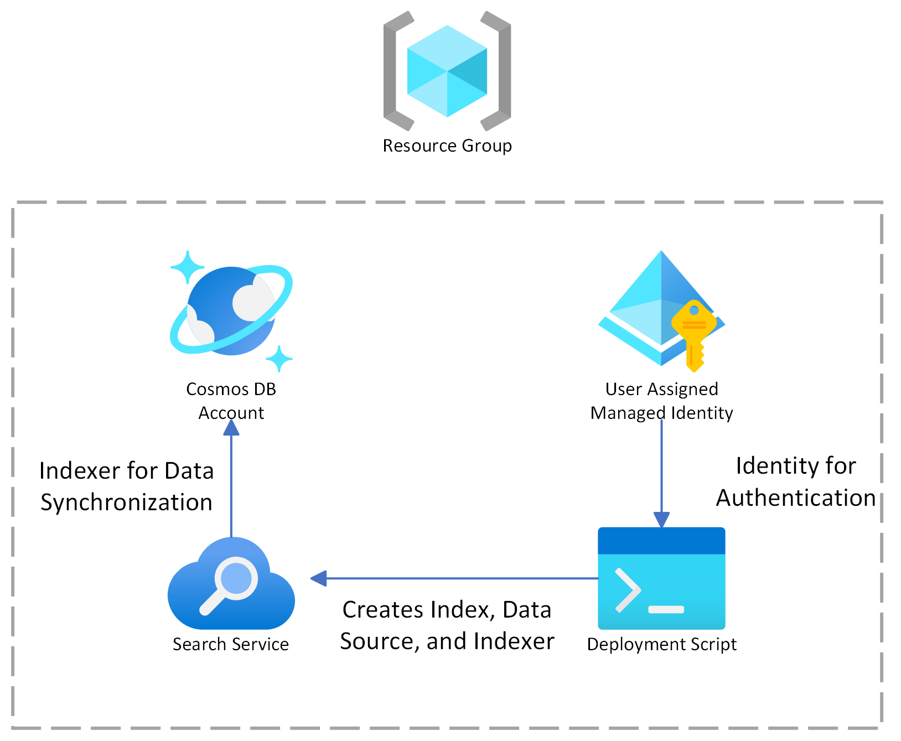

# Bicep deployment of Azure Cognitive Search

This repository contains a template that deploys Azure Cognitive Search and automatically creates an index, data source, and indexer.

The sample uses the [Azure CLI](https://learn.microsoft.com/cli/azure/) and [Bicep](https://learn.microsoft.com/azure/azure-resource-manager/bicep/overview?tabs=bicep).

The template creates a billable [Azure Cognitive Search](https://learn.microsoft.com/azure/search/search-create-service-portal). You can't use the free tier for this scenario.

Azure Cognitive Search is configured with [Azure Cosmos DB NoSQL](https://learn.microsoft.com/azure/cosmos-db/try-free?tabs=nosql). the search resource is created with an an index, data source, and indexer. The indexer runs every 5 minutes on a schedule to synchronize the index with the Cosmos database.

## How it works

The [Bicep](https://learn.microsoft.com/azure/azure-resource-manager/bicep/overview?tabs=bicep) script creates the following resources:

+ An [Azure Cosmos DB NoSQL](https://learn.microsoft.com/azure/cosmos-db/try-free?tabs=nosql) account.
+ An [Azure Cognitive Search](https://learn.microsoft.com/azure/search/search-what-is-azure-search) service
+ A [User-Assigned Managed Identity](https://learn.microsoft.com/azure/active-directory/managed-identities-azure-resources/overview). This is combined with [role-based access control](https://learn.microsoft.com/azure/search/search-security-rbac) to allow automatic deployment of an [index](https://learn.microsoft.com/azure/search/search-what-is-an-index), [data source](https://learn.microsoft.com/azure/search/search-indexer-overview), and [indexer](https://learn.microsoft.com/azure/search/search-indexer-overview) to the search service.
+ A [deployment script](https://learn.microsoft.com/azure/azure-resource-manager/templates/deployment-script-template) which enables the Bicep template to use the [REST API](https://learn.microsoft.com/rest/api/searchservice/) to configure the search service.



## Prerequisites

+ [Azure subscription](https://azure.microsoft.com/free/)
+ [Azure CLI](https://learn.microsoft.com/cli/azure/install-azure-cli)
+ Permission to create and access resources in Azure

## Sample set up

1. Install the [Azure CLI](https://learn.microsoft.com/cli/azure/install-azure-cli) or another supported tool for Bicep deployment.

1. Clone or download this sample repository.

1. Extract contents if the download is a zip file. Make sure the files are read-write.

1. Sign in to your Azure account:

   `az login`

1. If you have multiple Azure subscriptions, list them and get the subscription ID of the one you want to use.

   ```azurecli
   az account show
   ```

1. Set it to the correct subscription ID:

   ```azurecli
    az account set --subscription <YOUR-SUBSCRIPTION-ID>
   ```

1. Create a resource group to contain all of the resources. If you're deploying and comparing more than one option, create a separate resource group for each one.

   ```azurecli
   az group create --name demoResourceGroup --location westus
   ```

## Run the sample

The deployment imports data from Cosmos DB NoSQL into a search index on a search service using an [indexer](https://learn.microsoft.com/azure/search/search-howto-index-cosmosdb).

For synchronization, this sample uses a scheduled [indexer to pull data into a search index](https://learn.microsoft.com/azure/search/search-what-is-data-import#pulling-data-into-an-index). On the search service, the indexer runs at a 5 minute interval. A 5-minute interval is considered the minimum for indexer schedules.


1. From the command line, navigate to the `bicep` directory in the sample.

1. Optionally, review the bicep file (cosmosdb-indexer-sync.bicep) or parameters file (cosmosdb-indexer-sync.parameters.json). Feel free to change attributes such as the SKU (tier).

1. Run the next CLI command to create the Cosmos DB account, database, and search resource:

   ```azurecli
   az deployment group create --resource-group <YOUR-RESOURCE-GROUP> --template-file cosmosdb-indexer-sync.bicep --mode Incremental --parameters @cosmosdb-indexer-sync.parameters.json
   ```

You can use the same resource group you created earlier (demoResourceGroup). It takes several minutes to deploy all of the resources. The script outputs status to the command line once everything is deployed. The following output is trimmed for brevity.

```bash
{
  "id": "/subscriptions/000000000000000000000000000000000/resourceGroups/demoResourceGroup/providers/Microsoft.Resources/deployments/cosmosdb-indexer-sync",
  "location": null,
  "name": "cosmosdb-indexer-sync",
  "properties": {
    "correlationId": "ecbecc70-c3f4-476c-b5a1-e804f3489775",
    "debugSetting": null,
    "dependencies": [
      {
        "dependsOn": [
          {
            "id": "/subscriptions/00000000000000000000000/resourceGroups/demoResourceGroup/providers/Microsoft.DocumentDB/databaseAccounts/wmada6ilf3yneaccount",
            "resourceGroup": "demoResourceGroup",
            "resourceName": "wmada6ilf3yneaccount",
            "resourceType": "Microsoft.DocumentDB/databaseAccounts"
          }
        ],
. . . 
    "provisioningState": "Succeeded",
    "templateHash": "9404979489974435321",
    "templateLink": null,
    "timestamp": "2023-06-29T17:33:03.504780+00:00",
    "validatedResources": null
  },
  "resourceGroup": "demoResourceGroup",
  "tags": null,
  "type": "Microsoft.Resources/deployments"
}
```

## Test the deployment

The indexer is configured to use the built-in Cosmos DB ToDo sample database. To test the deployment:

1. Navigate to the demoResourceGroup to find the Cosmos DB and search resource.

1. In search, verify the index, indexer, data source are created and that the index has zero documents.

1. In Cosmos DB, use Data Explorer to add a few items to the built-in sample ToDo database. The ToDo database has an "id" field and metadata. The search index on Azure Cognitive Search has two fields ("rid", "description"). 

   + The "rid" field in the search index is populated from the _rid metadata field that's autopopulated in Cosmos DB.

   + For "description, add a "description" in each ToDo item that you add in Cosmos DB. Note that the "id" field isn't used in this sample.

     ```json
     {
        "id": "first",
        "description": "hello world"
     }
     ```

1. Wait for five minutes, and then check the indexes in the search services. You should see the newly added content.

## Sample clean up

This sample creates billable Azure resourcess. After completing this exercise, delete any resources you no longer need.

1. Sign in to the Azure portal.

1. To delete all of the resources, find and delete the resource group that you created.

## Resources

+ [Azure Cognitive Search documentation](https://learn.microsoft.com/azure/search/)
+ [Samples browser on Microsoft Learn](https://learn.microsoft.com/samples/browse/)
+ [Training](https://learn.microsoft.com/training/)